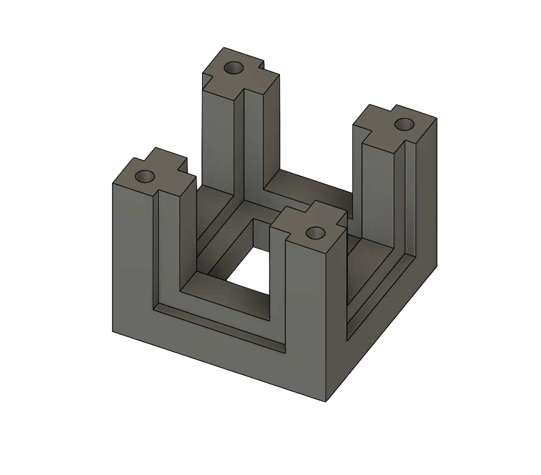
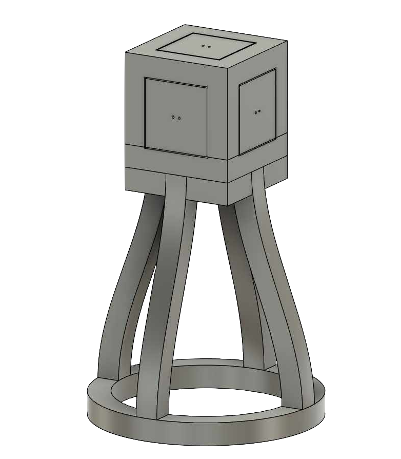

# ADCS Application: Sun Sensor Demo

This repository contains a basic implementation of a Sun Sensor system that is part of an Attitude Determination and Control System (ADCS). The Sun Sensor is a key component that helps determine the orientation of a satellite or spacecraft relative to the sun. This demo application is designed to be easily extended with additional sensors, actuators, and algorithms, making it a foundational piece for a larger ADCS application.

## Overview

## Project Structure

```
ADCS/
│
├── adcs.py                  # The main file for the ADCS, it includes integration with sensors, actuators.
├── sun_sensor.py            # Contains a set of photoresistors and uses their readings to calculate the light vector. 
├── photoresistor.py         # Handles interactions with individual photoresistor sensors - reading raw values and normalizing the data.
└── config.py                # Configuration settings for the photoresistors, plot app. Set up logging configuration 
```

## Hardware Setup
### Cube Sensor Module
The sensing unit is a custom 3D-printed cube designed to house five photoresistors, each mounted on a separate square PCB and positioned on an exposed face of the cube. This layout allows the system to capture light intensity from multiple directions.
<p align="center">
  
  
  
</p>
Each sensor is aligned with one of the primary axes in 3D space (x, y, or z), enabling vector-based estimation of the light’s direction. The PCBs are cut from double-sided fiberglass prototyping boards and mounted flush into the structure for uniform and stable placement.
<br><br>
A sixth PCB, located at the bottom of the cube, serves as a central hub for power and ground distribution. The structure is elevated on a base with legs to allow cable routing from underneath. To aid orientation during testing, each sensor face is uniquely color-coded.

<p align="center">
  
</p>

### Pin Connections to BeagleBone Black
Each photoresistor is connected to the analog inputs of the BeagleBone Black. Specifically, the following pins were used:

<table align="center" style="margin-left: auto; margin-right: auto; text-align: center;">
  <thead>
    <tr>
      <th>Label</th>
      <th>BBB Header Pin</th>
      <th>Color</th>
      <th>Vector</th>
      <th>Function</th>
    </tr>
  </thead>
  <tbody>
    <tr><td>AIN0</td><td>P9_39</td><td>Orange</td><td>(0, 0, 1)</td><td>Vector</td></tr>
    <tr><td>AIN1</td><td>P9_40</td><td>White</td><td>(1, 0, 0)</td><td>Vector</td></tr>
    <tr><td>AIN2</td><td>P9_37</td><td>Green</td><td>(0, -1, 0)</td><td>Vector</td></tr>
    <tr><td>AIN3</td><td>P9_38</td><td>Yellow</td><td>(0, 1, 0)</td><td>Vector</td></tr>
    <tr><td>AIN4</td><td>P9_36</td><td>Brown</td><td>(-1, 0, 0)</td><td>Vector</td></tr>
    <tr><td><strong>VDD_ADC</strong></td><td>P9_32</td><td>Blue</td><td>—</td><td>Power (1.8 V)</td></tr>
    <tr><td><strong>GND_ADC</strong></td><td>P9_34</td><td>Red</td><td>—</td><td>Ground</td></tr>
  </tbody>
</table>

A sixth PCB at the bottom of the cube centralizes power and ground distribution. The VDD and GND pins from the BeagleBone Black are connected to ensure the proper operation of the sensor module.

## Running the ADCS Application
### Option 1: Manual Deployment (Recommended for Prototyping)
The **ADCS** application can be run independently on the BeagleBone Black Wireless (BBB), making it suitable for testing and development without requiring full integration into a Yocto Linux build.

This lightweight approach is ideal for experimenting with sensor behavior, testing algorithms, or extending the application with new components.

<div style="margin-left: 40px;">
1. Clone the repository to the BBB:
```
git clone https://github.com/Stayzie-R/ADCS.git
cd ADCS
```
2. Install dependencies (if any):
```
pip3 install -r requirements.txt
```
3. Run the main application:
```
python3 adcs.py
```
</div>

## Light Vector Calculation
The light vector L is calculated using the difference in light intensity between opposing photoresistors aligned with each axis. If I+ is the intensity from the sensor in the positive direction of an axis, and I- is from the negative:

$$
\vec{L} = \frac{1}{\max(I)} \cdot 
\begin{bmatrix}
I_{x+} - I_{x-} \\
I_{y+} - I_{y-} \\
I_{z+} - I_{z-}
\end{bmatrix}
$$

This vector is then normalized.

## Logging
The application uses Python's logging library to log important events, errors, and system behavior. By default, logs are output to the console, but you can configure the logging output as needed in `config.py`.


## Plot App Integration
The system integrates with a [plot app](https://github.com/Stayzie-R/adcs_plot_app)  to visualize the calculated light vectors. The plot app is hosted on a remote server, and the system sends updates to it via an API.

Configurable Parameters:
- **`UPDATE_VECTOR_URL`**: The URL for the plot app's API endpoint `/update_vector`.
- **`API_KEY`**: The API key required for authentication with the plot app.

## Extending the ADCS
This application is a starting point for building a more advanced ADCS. You can add additional sensors, such as magnetometers or gyroscopes, to improve attitude determination. Actuators like reaction wheels or control moment gyroscopes can also be integrated for attitude control.

## License
MIT License – feel free to use, modify, and contribute.